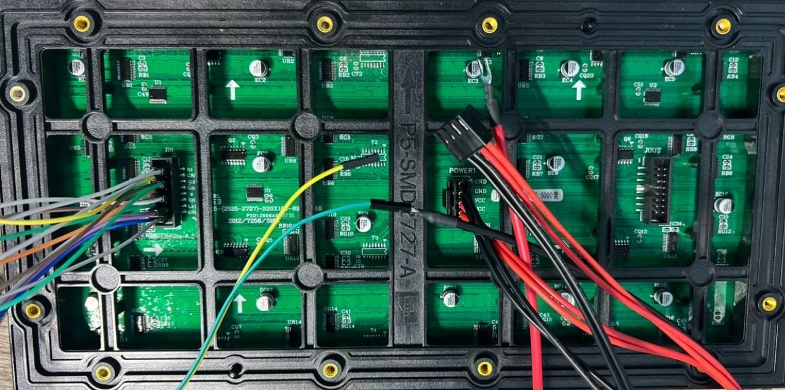
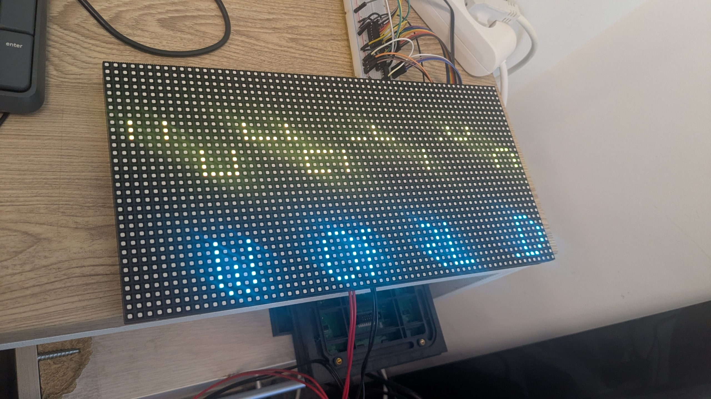
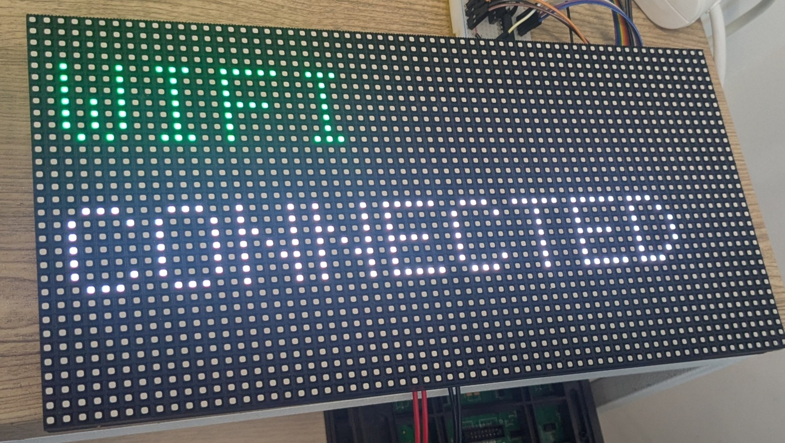

## P5 Outdoor HUB75 ICN2037 Mapping Example

ESP-IDF example project for a `64x32` outdoor `P5` HUB75 RGB panel with:

- `1/8 scan`
- `ICN2037`
- physical size `320x160 mm`

This project shows one working way to drive that panel with `ESP32-HUB75-MatrixPanel-DMA` by remapping a logical `64x32` drawing surface into the panel's physical DMA layout.

### Overview

The panel used here does not behave like a simple linear `64x32` framebuffer. The solution in this repository is:

- keep the application drawing space as normal `64x32`
- configure the DMA surface as `128x16`
- remap each logical `8x8` tile into the position expected by the panel

The mapping is explicit and panel-specific. If you have the same panel, this project should work as a starting point. If your panel is similar but not identical, the main file to change is `main/panel_config.h`.

### Hardware

- MCU: ESP32
- Panel: HUB75 outdoor RGB
- Resolution: `64x32`
- Scan rate: `1/8`
- Driver IC: `ICN2037`

### Project Layout

- `main/main.cpp`  
  Minimal demo entrypoint.
- `main/hub75_panel.cpp`  
  HUB75 wrapper and pixel remapping implementation.
- `main/hub75_panel.h`  
  Public drawing API used by the demo.
- `main/panel_config.h`  
  Panel size, pin mapping, DMA geometry, and tile map.
- `components/ESP32-HUB75-MatrixPanel-I2S-DMA/`  
  Upstream HUB75 DMA driver library used by this project.

### Mapping

The logical display is divided into `8x8` tiles:

- `64 / 8 = 8` tiles across
- `32 / 8 = 4` tiles down

Each logical tile is mapped into a physical tile position in the `128x16` DMA surface.

Logical tile grid (`ty`, `tx`) to physical tile grid (`ptx`, `pty`):

```text
ty=0: (8,0)  (9,0)  (10,0) (11,0) (12,0) (13,0) (14,0) (15,0)
ty=1: (0,0)  (1,0)  (2,0)  (3,0)  (4,0)  (5,0)  (6,0)  (7,0)
ty=2: (8,1)  (9,1)  (10,1) (11,1) (12,1) (13,1) (14,1) (15,1)
ty=3: (0,1)  (1,1)  (2,1)  (3,1)  (4,1)  (5,1)  (6,1)  (7,1)
```

In code, the mapping lives in `main/panel_config.h` as `PANEL_TILE_MAP`.

### Wiring Used

The tested pin assignment in this repository is:

- `R1 = 4`
- `G1 = 5`
- `B1 = 6`
- `R2 = 7`
- `G2 = 15`
- `B2 = 16`
- `A = 18`
- `B = 8`
- `C = 3`
- `D = -1`
- `E = -1`
- `LAT = 40`
- `OE = 2`
- `CLK = 41`

These values are defined in `main/panel_config.h`.

### Driver Configuration

This project uses:

- DMA surface: `128x16`
- chain length: `1`
- driver mode: `HUB75_I2S_CFG::SHIFTREG`
- clock: `HUB75_I2S_CFG::HZ_8M`
- `clkphase = false`
- `latch_blanking = 3`

Although the panel uses `ICN2037`, the working setup here uses the generic `SHIFTREG` mode from the upstream library.

### Photos

#### Panel Back


#### Before Mapping Fix


#### Working Result


### Build

Standard ESP-IDF workflow:

```bash
idf.py set-target esp32s3
idf.py build
idf.py flash monitor
```

Adjust the target if you are using a different ESP32 variant supported by the upstream library and by your wiring.

### Customizing For Another Panel

If your panel is close to this one but not identical, edit `main/panel_config.h`:

- change the HUB75 pin assignment
- change the DMA geometry if needed
- change `PANEL_TILE_MAP`
- use `flip_x` and `flip_y` if a tile is mirrored

The demo in `main/main.cpp` draws a border, tile grid, and labels so it is easy to verify whether the mapping is correct.

### Attribution

This project is built on top of `ESP32-HUB75-MatrixPanel-DMA` by `mrcodetastic`:

- Upstream repository: <https://github.com/mrcodetastic/ESP32-HUB75-MatrixPanel-DMA>
- Upstream license: `MIT`

The upstream component license file is preserved in:

- `components/ESP32-HUB75-MatrixPanel-I2S-DMA/LICENSE.txt`

Additional attribution notes are in `THIRD_PARTY_NOTICES.md`.
